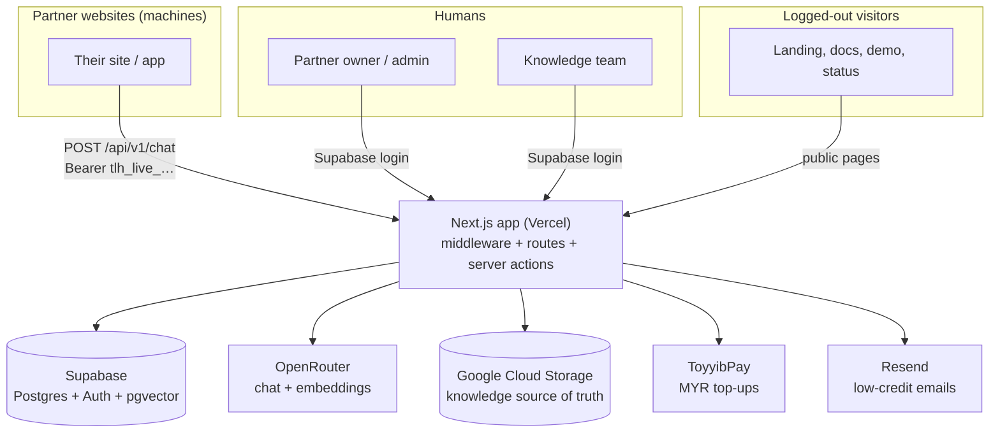
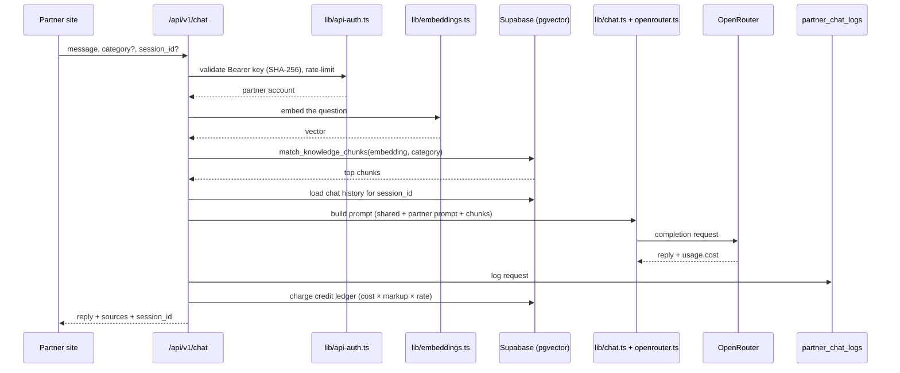
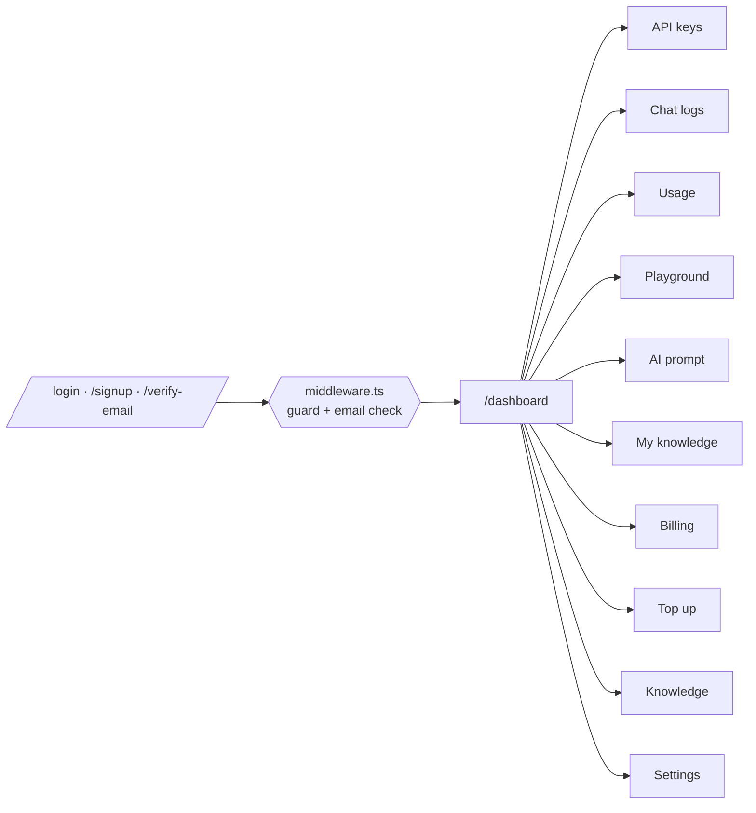
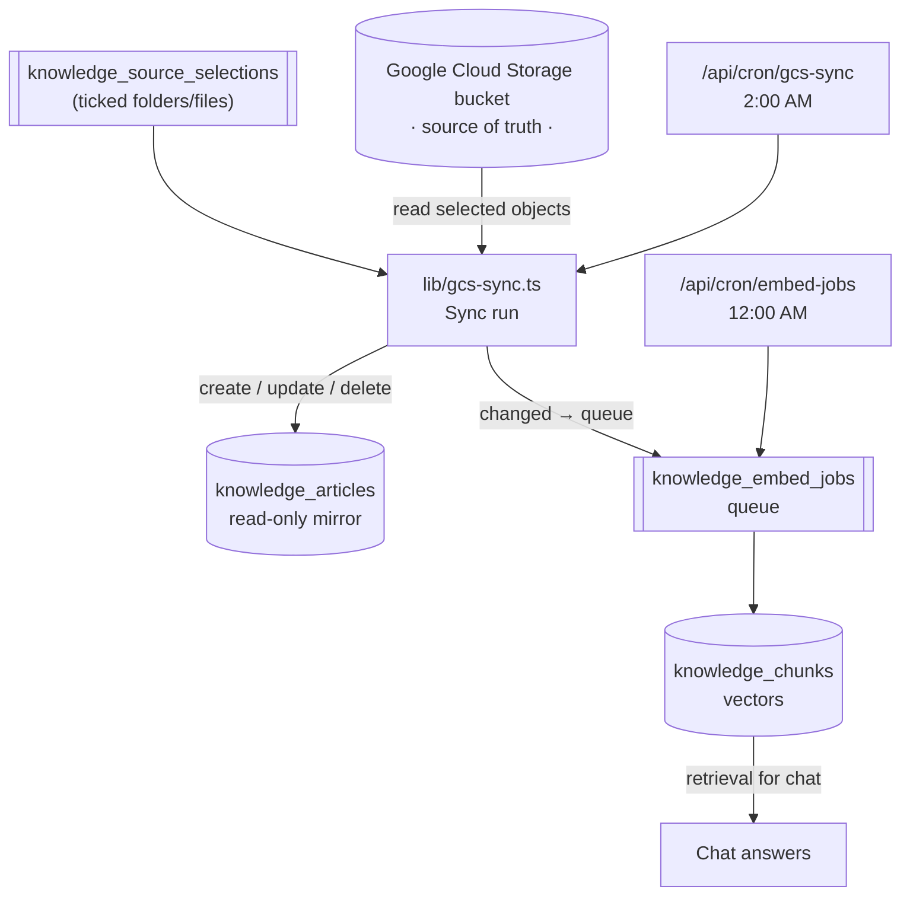
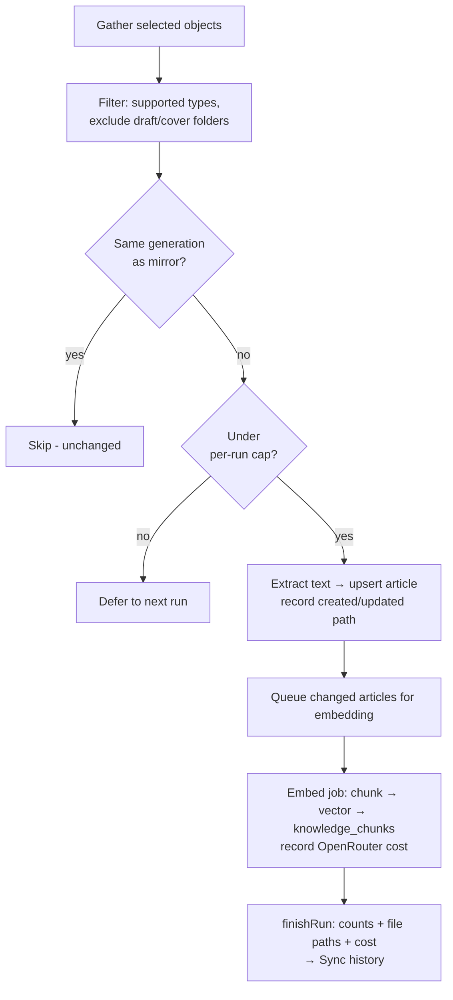
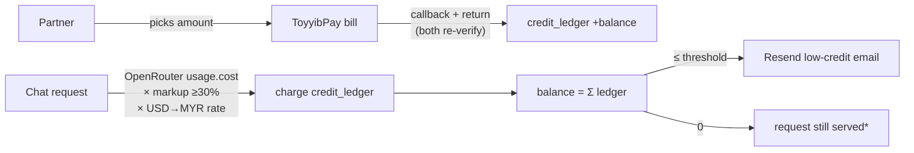
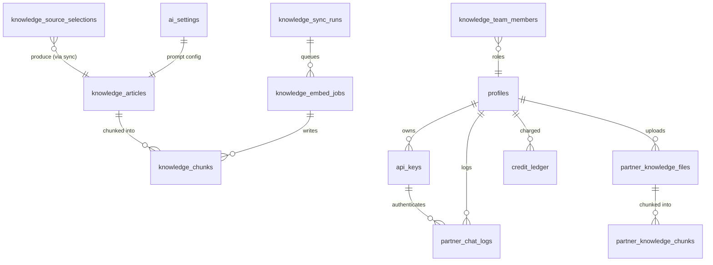

# Tanyalah Ustaz Partner — Architecture

How the whole system fits together: who talks to whom, what runs when, and
where each piece lives. Written to be read top-down — start with the big
picture, then zoom into the part you care about.

> Companion docs: [README](../README.md) (setup + features) and
> [SYSTEM_EVOLUTION.md](SYSTEM_EVOLUTION.md) (why it grew this way).

---

## 1. The big picture

Two audiences, one Next.js server.



Two auth systems live side by side:

- **Humans** — Supabase Auth. A cookie session, checked in `middleware.ts`.
- **Machines** — API keys (`tlh_live_…`). SHA-256 hashed, checked per request.

---

## 2. Request lifecycle: a partner chat call

`POST /api/v1/chat` is the main integration endpoint.



Supporting modules:

| File | Responsibility |
|------|----------------|
| `lib/api-auth.ts` | Bearer key validation + rate limiting |
| `lib/retrieval.ts` | Vector search, keyword fallback, thresholds |
| `lib/rag-context.ts` | Turn chunks into prompt reference material |
| `lib/chat.ts` | Orchestrate retrieval → prompt → model |
| `lib/chat-stream.ts` | Streaming variant of the same pipeline |
| `lib/openrouter.ts` | OpenRouter HTTP client |
| `lib/chat-history.ts` | Multi-turn session memory (`session_id`) |

Greetings and small talk skip retrieval entirely (`lib/small-talk.ts`), so they
never produce random citations.

---

## 3. The dashboard (partner portal)



- Writes happen in **server actions** under `app/actions/`.
- `middleware.ts` redirects logged-out users to `/login`, and logged-in but
  unverified users to `/verify-email`.

---

## 4. Knowledge pipeline (GCS → Supabase → AI)

Google Cloud Storage is the **source of truth**. Supabase keeps a **read-only
mirror**. The app never authors knowledge.



Rules baked in:

- **One-way only** — Google Cloud is truth; the mirror is disposable.
- **Selection-driven** — only ticked folders/files sync, never the whole bucket.
- **Change detection** — compares object `generation`; unchanged files skip.
- **RAG** — only retrieved chunks reach the prompt, never the whole base.

### Partner knowledge (private, per-partner)

Alongside the shared library, each partner can upload their **own** documents at
`/dashboard/knowledge-base`. These are stored in `partner_knowledge_files` /
`partner_knowledge_chunks` — separate tables from the shared ones, scoped to one
`partner_id` with RLS, and searched by `match_partner_knowledge_chunks_hybrid`.
At chat time both libraries are retrieved in parallel and injected as distinct
prompt sections; a partner's files are **never** visible to another partner.
Embedding a file is billed to that partner's credit ledger (`reason =
'embedding'`, same markup as chat). See `lib/partner-knowledge.ts` and
`lib/partner-knowledge-search.ts`.

**Storage:** like the admin flow, the original file is never kept — it is
extracted to text in memory and discarded. Only the chunk rows (which already
contain the text) plus a short display preview are stored, so the text is not
duplicated.

---

## 5. Inside a sync run



Caps and knobs (`lib/gcs-sync.ts`, `.env`):

| Variable | Default | Meaning |
|----------|---------|---------|
| `GCS_SYNC_MAX_FILES` | 10 | Max new/changed files per run |
| `GCS_SYNC_CONCURRENCY` | 4 | Files downloaded/extracted/inserted in parallel |
| `GCS_SYNC_MAX_BYTES` | 100 MB | Max file size to read |
| `GCS_SYNC_EXCLUDE_PREFIXES` | cover-image, cover, covers | Folders to skip |
| `GCS_SYNC_EXTENSIONS` | all supported | Limit to e.g. `.pdf` |
| `GCS_AI_STRUCTURING` | off | Let the model draft fields |

Sync history stores aggregate counts, per-file paths (capped), errors, and the
recorded embedding cost per run.

---

## 6. Billing & money flow



\* Charging is recorded but never blocks a request in the current code.

Pricing (`lib/billing.ts`, `lib/credit.ts`):

```
partner charge = OpenRouter cost (USD) × (1 + markup%) × USD→MYR rate
```

- Markup floor of **30%** is enforced by the database.
- `OPENROUTER_USD_MYR_RATE` defaults to `4.7`.
- Top-ups are idempotent: both `/api/toyyibpay/callback` and `/return` re-check
  the bill before crediting.

---

## 7. Data model (core tables)



---

## 8. Scheduled work (Vercel Cron)

| Path | Schedule | Purpose |
|------|----------|---------|
| `/api/cron/gcs-sync` | `0 2 * * *` (2 AM) | Pull selected bucket files, queue embeddings |
| `/api/cron/embed-jobs` | `0 0 * * *` (12 AM) | Sweep any remaining embedding jobs |

Primary embedding work also runs in the background right after a sync, and
admins can flush the queue on demand from **Sources → Process queue**.

---

## 9. Where things live

| Path | Role |
|------|------|
| `app/api/v1/` | Public partner API: chat, sessions, me, usage, health, openapi |
| `app/api/cron/` | Scheduled GCS sync + embed-job sweeper |
| `app/api/toyyibpay/` | Payment callback + return |
| `app/api/knowledge/` | Dashboard-internal knowledge endpoints (preview, sync, embed) |
| `app/dashboard/` | Partner portal (auth-gated) |
| `app/actions/` | Server actions — all portal writes |
| `app/docs/` | Public API documentation |
| `lib/gcs-sync.ts` | Knowledge mirror engine |
| `lib/embeddings.ts` + `lib/embed-knowledge.ts` | Vectors + cost tracking |
| `lib/chat.ts` + `lib/retrieval.ts` + `lib/rag-context.ts` | RAG answer pipeline |
| `lib/partner-knowledge.ts` + `lib/partner-knowledge-search.ts` | Private per-partner file knowledge base |
| `lib/billing.ts` + `lib/credit.ts` | Pricing + ledger |
| `middleware.ts` | Auth + email-verification guard |
| `supabase/migrations/` | Schema history |

---

## One-line summary

> Partners call a chat API with a key; the server embeds the question, finds
> relevant chunks in Supabase (mirrored from Google Cloud Storage), asks
> OpenRouter, logs and charges the answer — while humans manage keys, knowledge,
> prompts, and billing from a Supabase-auth dashboard.
